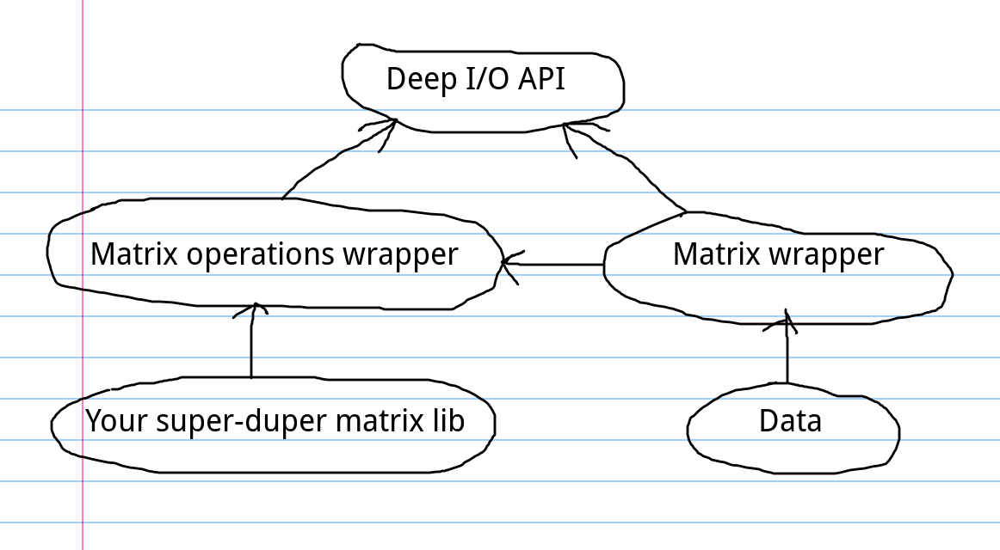

# Deep I/O
Single-header library provides you low-level API for deep learning.

**Features**:
- Low-level API works directly with matrices.
- Reference based API. That means, that there are no allocations of data at all. API's methods just take a references to ready data. So, you can use this library anywhere (include embedded systems).
- Matrix Computation Interface. Provides you to use any matrix library you want.

